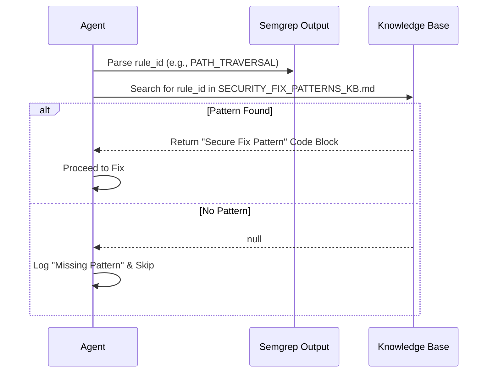
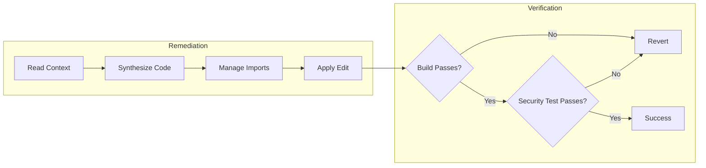

I need an Business view PPT of the below prompt , please analyze carefully and design 6 to 7 slide : # 🛠️ Semgrep Remediation Workflow: Technical Deep Dive

## 📋 Overview

This document outlines the technical workflow used by the Semgrep Remediation Agent to detect, analyze, remediate, and verify security vulnerabilities in Java/Spring Boot applications. It details the step-by-step process from rule triggering to final code verification.

```mermaid
graph TD
    Start([Start]) --> Detect[🔍 Detect Vulnerabilities<br/>(Semgrep Scan)]
    Detect --> Match{🧩 Match Pattern<br/>in KB?}
    Match -- Yes --> Fix[🛡️ Apply Fix<br/>(Code Transformation)]
    Match -- No --> Skip[❌ Skip & Report]
    Fix --> Verify{🧪 Verify Fix<br/>(Build & Test)}
    Verify -- Pass --> Commit[✅ Mark as Fixed]
    Verify -- Fail --> Revert[Undoes Changes]
    Revert --> Manual[⚠️ Mark for Manual Review]
    Skip --> End([End Loop])
    Commit --> End
    Manual --> End
```

---

## 1. 🔍 Vulnerability Detection (The "Scan" Phase)

The agent initiates remediation by running a Semgrep scan using a specific ruleset designed for Java security.

### 1.1 Command Execution
The agent executes Semgrep with JSON output to parse results programmatically:
```bash
semgrep scan --config=p/java --json --output=semgrep_results.json
```

### 1.2 Issue Identification
Semgrep identifies issues matching specific rule IDs (e.g., `java.lang.security.audit.path-traversal`).
- **Input**: Source code files (`.java`)
- **Output**: JSON object containing:
  - `path`: File location
  - `start`/`end`: Line numbers
  - `rule_id`: The specific vulnerability type
  - `extra`: Metadata and message

---

## 2. 🧩 Pattern Matching & KB Lookup (The "Brain" Phase)

Before applying any fix, the agent consults the **Knowledge Base (KB)**. This is a strict whitelist approach—if a fix isn't in the KB, it isn't applied.

### 2.1 The Lookup Process



1.  **Extract Rule ID**: The agent parses the `rule_id` from the Semgrep JSON (e.g., `find_sec_bugs.PATH_TRAVERSAL_IN-1`).
2.  **Query KB**: It searches `SECURITY_FIX_PATTERNS_KB.md` for a matching section.
3.  **Retrieve Pattern**: If matched, it retrieves the "Secure Fix Pattern" code block.

### 2.2 Example: Path Traversal
*   **Vulnerability Identified**:
    ```java
    // ❌ Vulnerable Code
    public File readFile(String fileName) {
        return new File(baseDir + "/" + fileName); // User input directly in file path
    }
    ```
*   **KB Pattern Retrieved**:
    ```java
    // ✅ KB Fix Pattern
    Path basePath = Paths.get(baseDir).normalize();
    Path filePath = basePath.resolve(fileName).normalize();
    if (!filePath.startsWith(basePath)) {
        throw new SecurityException("Path traversal attempt");
    }
    ```

---

## 3. 🛡️ Remediation Application (The "Fix" Phase)

The agent applies the fix using a "surgical replacement" strategy to minimize code churn and regression risk.

### 3.1 Transformation Steps
1.  **Context Analysis**: The agent reads the surrounding code (5-10 lines before/after) to understand variable names and context.
2.  **Code Synthesis**: It adapts the generic KB pattern to the specific code context (e.g., renaming `fileName` to `userInputName` if that's what the variable is called).
3.  **Dependency Management**: If the fix requires new imports (e.g., `java.nio.file.Path`), the agent adds them to the file header.
4.  **Application**: The `replace_string_in_file` tool is used to swap the vulnerable block with the secure block.

### 3.2 Advanced Handling: Taint Flow Isolation
For complex static analysis issues where tools like Semgrep flag false positives due to "taint tracking" (data flow) issues, the agent uses the **SecureFileOperations** pattern (`ADVANCED_SECURITY_PATTERNS_KB.md`).

*   **Mechanism**: It introduces an intermediate wrapper class that explicitly validates input and returns a "clean" object, effectively breaking the taint chain seen by the static analyzer.

---

## 4. 🧪 Verification & Testing (The "Quality" Phase)

A fix is only considered complete if it passes a generated security test.



### 4.1 Test Generation
The agent uses templates from `TEST_GENERATION_KB.md` to create specific unit tests.
*   **Location**: Logic is placed in `src/test/java/...` mirroring the source package.
*   **Strategy**: "Attack-driven" testing.
    *   *Positive Test*: Valid input works as expected.
    *   *Negative Test*: Malicious input (e.g., `../../etc/passwd`) throws `SecurityException`.

### 4.2 Execution & Validation
1.  **Build**: Run `mvn compile` to ensure no syntax errors.
2.  **Test**: Run `mvn test` to execute the new security tests.
3.  **Gate**:
    *   **Pass**: Proceed to next issue.
    *   **Fail**: Revert changes and mark as "Requires Manual Review".

---

## 5. 📝 Reporting (The "Audit" Phase)

Transparency is critical. The agent generates detailed Markdown reports.

### 5.1 `REMEDIATION_PLAN.md` (Pre-Fix)
*   Lists all identified issues.
*   Maps them to specific KB patterns.
*   Defines the planned action (Fix / Skip).

### 5.2 `FINAL_COMPLIANCE_REPORT.md` (Post-Fix)
*   **Status Matrix**: Total Fixed vs. Total Found.
*   **Verification Evidence**: Logs from the successful build and test run.
*   **Remaining Risks**: Any issues that could not be auto-fixed.

---

## 🚀 Summary of the "Zero-Defect" Loop

1.  **DETECT** (Semgrep Scan)
2.  **MATCH** (KB Pattern Lookup)
3.  **FIX** (Code Transformation & Import Management)
4.  **VERIFY** (Compile & Generic Security Test)
5.  **REPORT** (Audit Trail Generation)
